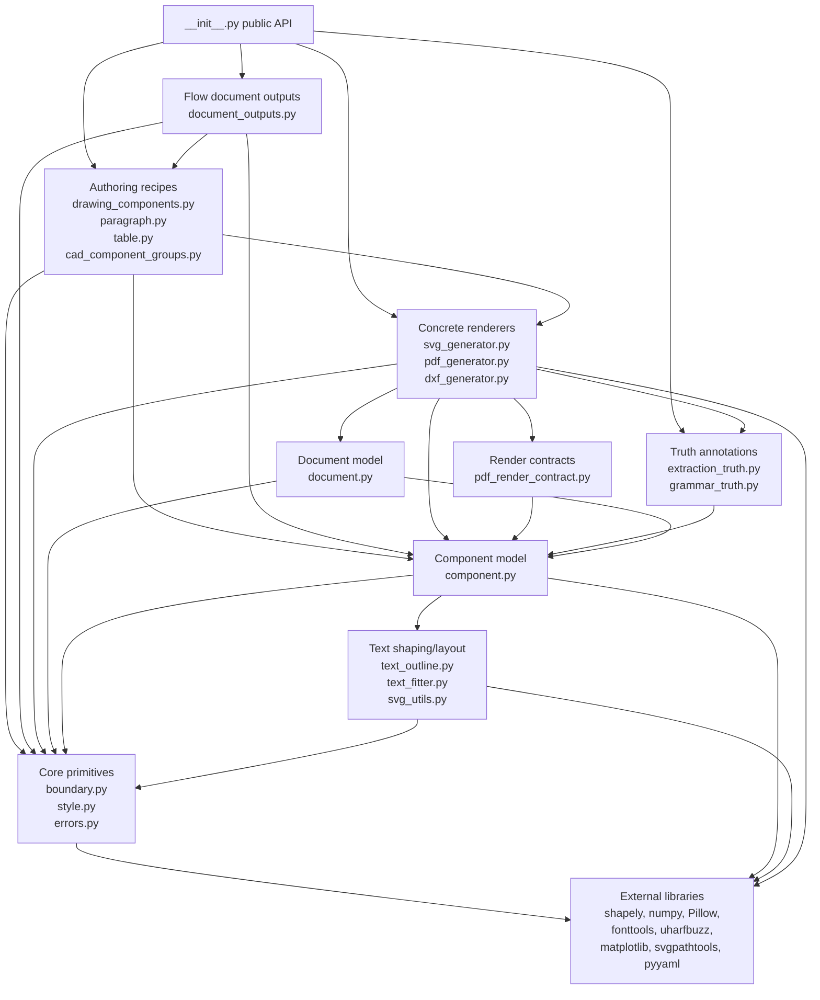

# Dependency Map

This map describes how InkGen modules should depend on each other. It is a
review aid, not a generated architecture model. Its purpose is to make contract
breakage visible before a code change is accepted.

## Reading The Map

An arrow means "depends on" or "is allowed to know about." Dependencies should
generally point downward from higher-level authoring APIs to lower-level
primitive contracts, or from concrete renderers to the shared model they render.

## Layer Responsibilities

| Layer | Owns | Must not own |
|---|---|---|
| Core primitives | Canvas bounds, styles, project exceptions | Renderer behavior or generated file formats |
| Component model | Geometry, points, bboxes, convex hulls, text components, component groups | File writing, PDF/SVG/DXF syntax, document-flow policy |
| Document model | Pages, layers, group containment, collision checks, YAML recipes | Renderer-specific classes or truth schema rules |
| Renderer-neutral authoring | Drawing recipes that can materialize to supported drawing outputs | Persistent renderer state or generated file bytes |
| Concrete renderers | SVG, PDF, and DXF serialization for drawing artifacts | Mutating component semantics or changing authoring contracts |
| Render contracts | Small proof-critical guards for renderer domains and live-path constraints | Generated bytes, geometry calculations, or broad renderer implementation |
| Flow document outputs | Paragraph/table/drawing export to DOCX, HTML, RTF, and text | Becoming the drawing renderer source of truth |
| Truth annotations | Stable extraction/grammar truth records and coordinate conversion | Changing rendered bytes or component layout |
| Text shaping/layout | Text outlines, fitting, and SVG utility flattening | Document ownership or output-format policy |

## Intended Dependency Direction

Use these default rules unless an ADR says otherwise.

1. Core primitives may depend on external libraries, but not on InkGen renderers
   or authoring layers.
2. Components may depend on core primitives and text helpers.
3. Documents may depend on components and core primitives.
4. Renderers may depend on documents, components, core primitives, and truth
   emitters.
5. Render contracts may depend on component abstractions and simple runtime
   type/domain checks. They should stay small enough to mutation-test directly.
6. Renderer-neutral drawing recipes may materialize into concrete renderers, but
   should not store concrete renderer instances as their own state.
7. Flow document outputs may consume paragraphs, tables, and renderer-neutral
   drawing recipes.
8. Truth emitters may read annotation attributes and geometry from any target,
   but must not alter rendered output.
9. `__init__.py` re-exports public APIs. It should not introduce behavior.

## Known Cross-Layer Edges

These edges are intentional today. Do not remove or expand them without checking
tests and, where appropriate, recording an ADR.

| Edge | Why it exists | Risk |
|---|---|---|
| `drawing_components.py -> svg_generator.py/pdf_generator.py` inside `to_component()` | Neutral recipes materialize into concrete drawing components on demand. | Adding stateful renderer coupling would break renderer neutrality. |
| `dxf_generator.py -> pdf_generator.py` indirectly through `component.to_component(OutputFormat.PDF)` for sampled geometry | DXF reuses existing point geometry for arcs, curves, paths, and regular polygons. | PDF changes to geometry sampling can alter DXF output. |
| `document_outputs.py -> drawing_components.py` | Flow documents can contain drawing groups and export them to DOCX/HTML/RTF/text. | Document outputs should not become the source of drawing geometry truth. |
| `pdf_generator.py -> extraction_truth.py/grammar_truth.py` | PDF documents emit parser-facing truth records in PDF coordinates. | Truth schema changes can break downstream parser fixtures. |
| `pdf_generator.py -> pdf_render_contract.py` | The PDF render path delegates proof-critical closed-domain checks to a small mutation-tested contract module. | Bypassing the helper weakens PO-GT-004 and can hide custom render paths. |
| `DocumentPDF -> ComponentGroupPDF -> built-in PDF components` | The PDF render path is intentionally closed so noninterference properties can be proven. | Arbitrary custom PDF render components are outside the proven contract. |
| `grammar_truth.py -> extraction_truth.py` | Grammar truth reuses source channel and PDF coordinate conversion constants. | Extraction truth changes can accidentally change grammar truth records. |
| `cad_component_groups.py -> svg_generator.py` | Legacy CAD helpers still build SVG-specific component groups. | This path is not renderer-neutral and should not be copied into new drawing recipes. |

## Public Contracts To Protect

These contracts are more important than individual implementation details.

| Contract | Relied on by | Breakage signal |
|---|---|---|
| Component `points`, `bbox`, and `convex_hull` shapes | Labels, segmentation masks, truth emitters, DXF geometry, collision checks | Coordinate drift, bad masks, wrong truth bboxes, off-canvas errors |
| `parameters` / `create_from_dict()` round trip | Tests, examples, generated fixture reproducibility | Serialized recipes fail to reload or lose annotations |
| `DrawingComponentGroup.to_group(output_format)` | SVG/PDF generation, truth propagation, downstream synthetic fixtures | Renderer-neutral recipes fail to materialize or lose labels |
| PDF coordinate frame `pdf_points_bottom_left` | DocInt parser validation and ground truth comparisons | Parser scores compare against the wrong coordinate system |
| Deterministic artifact bytes/records | Regression tests and fixture generation | Tests become flaky or fixtures churn |
| Closed PDF renderer component set | PDF noninterference proofs and deterministic rendering | Custom dynamic `generate_pdf()` paths can break proof obligations |
| `pdf_render_contract.py` guard semantics | PO-GT-004 mutation gate and PDF render-path failures | Unsupported groups/components render instead of failing at the boundary |
| `Layer.groups()` complete traversal | SVG/PDF renderers, truth emitters, and duplicate-label model layers | Reverting to `component_groups` collapses repeated labels |
| Dependency-free PDF/DXF/DOCX emitters | Project dependency policy | New package dependency appears without approval |
| Flow document block order | DOCX/HTML/RTF/text exports | Document content is reordered or omitted |
| Public exports in `__init__.py` | External callers and examples | Imports from `InkGen` break |

## Dependency Review Checklist

Use this before accepting a change that touches a module boundary.

1. Which module owns the behavior being changed?
2. Which modules import or call that behavior?
3. Which generated artifacts or serialized parameters depend on it?
4. Does the dependency direction still match this map?
5. Is the change adding a new cross-layer edge?
6. If a contract changed, is at least one dependent path tested?
7. If a known cross-layer edge changed, does an ADR or note explain why?
8. Did the change preserve deterministic output where expected?

## First Review Targets

These are good starting points for walking the DoD through InkGen:

1. `grammar_truth.py` and `pdf_generator.py` truth emission: small, current, and
   parser-facing.
2. `drawing_components.py` renderer-neutral recipes: central dependency boundary.
3. `document_outputs.py` flow documents: useful stress test for document versus
   drawing responsibilities.
4. `cad_component_groups.py` legacy SVG-specific path: useful example of a known
   dependency exception.
